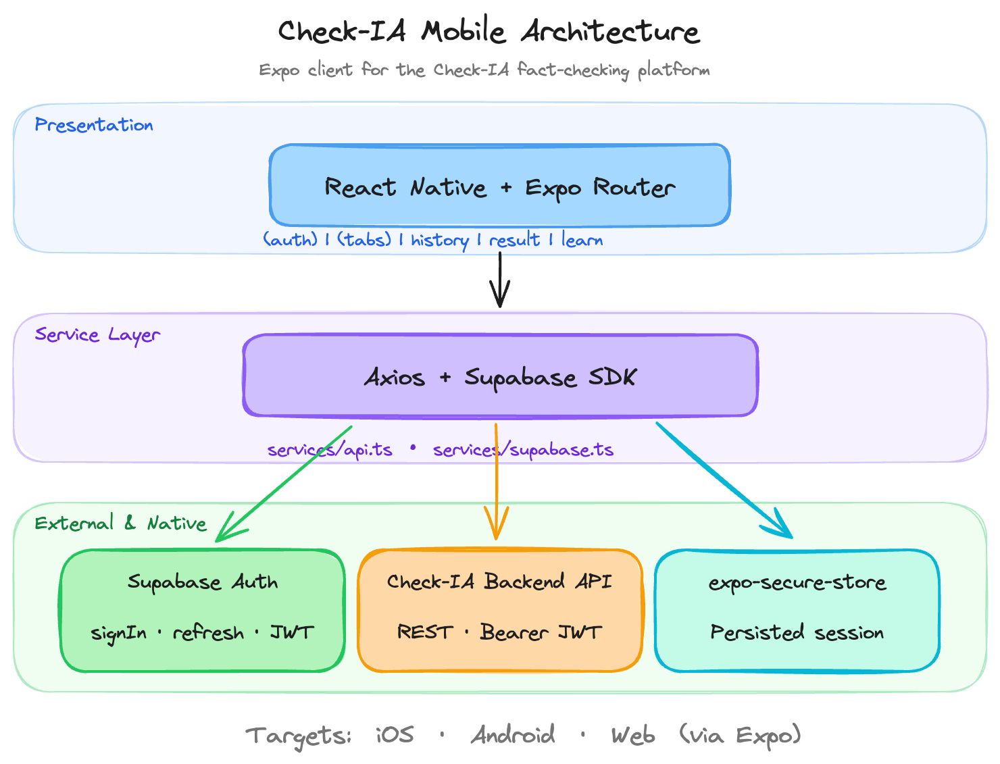

# Architecture Overview

Check-IA Mobile is organized around Expo Router routes, reusable feature components, and a small API service layer.

## System Diagram

<figure class="checkia-diagram">
  
  <figcaption>
    Editable source: <a href="../assets/mobile-architecture.excalidraw">mobile-architecture.excalidraw</a>
  </figcaption>
</figure>

## Main Areas

- `app/` contains Expo Router routes and screens.
- `components/` contains reusable UI and feature components.
- `hooks/` contains shared state and behavior.
- `services/` contains Supabase and Check-IA API clients.
- `utils/` contains testable mapping and helper functions.
- `data/` contains static learning content and fallback dashboard data.

For the implementation-level overview, see [Mobile Client](../ARCHITECTURE.md).

For backend endpoints used by the app, see [Backend API Contract](backend-api.md).
